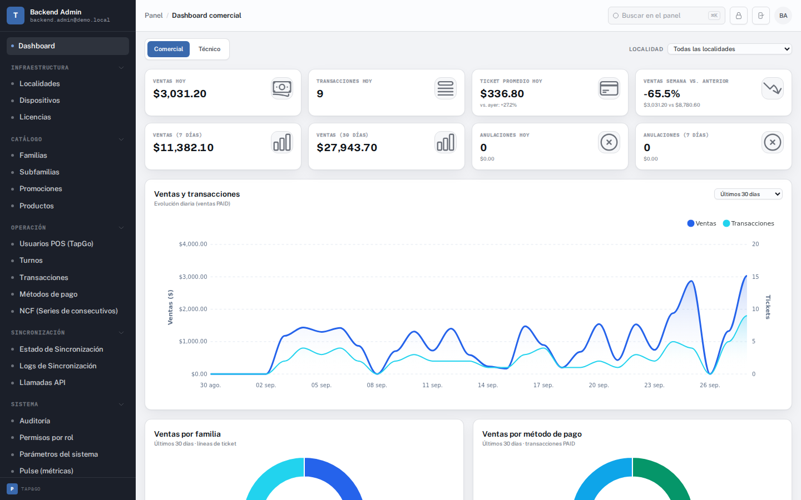
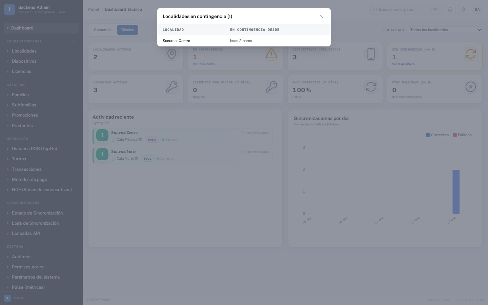
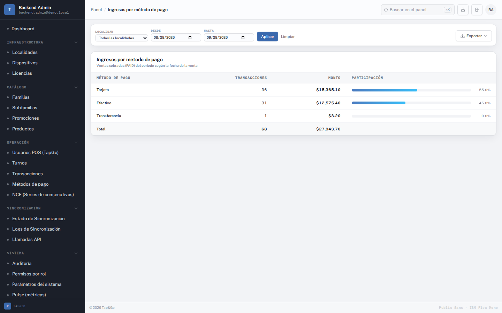
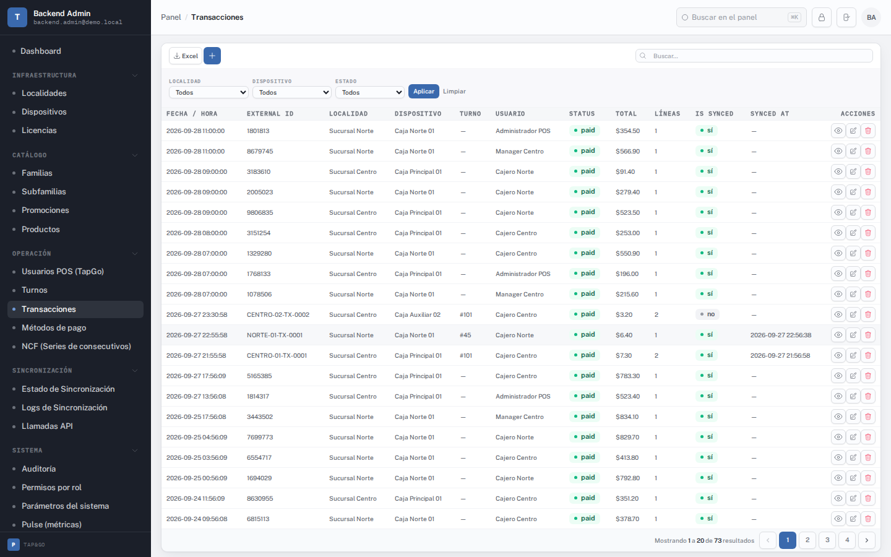
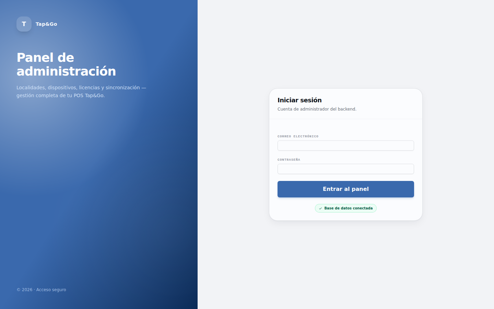
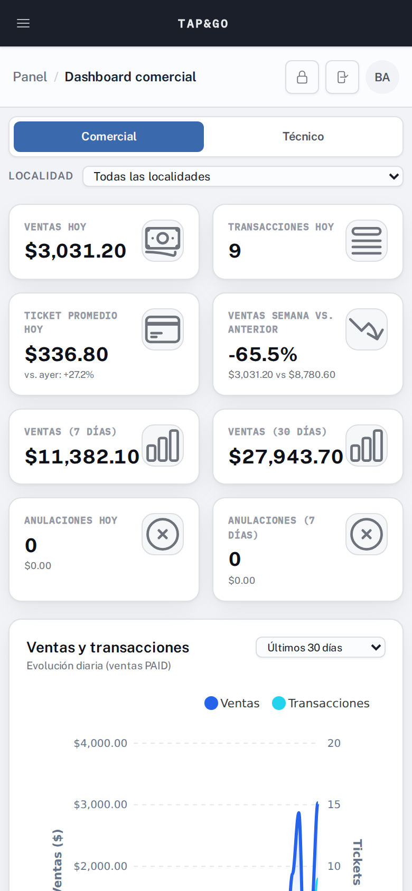
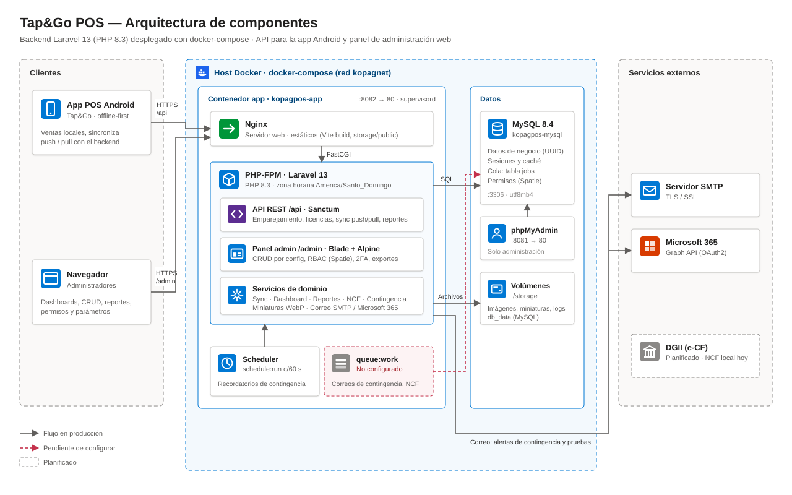
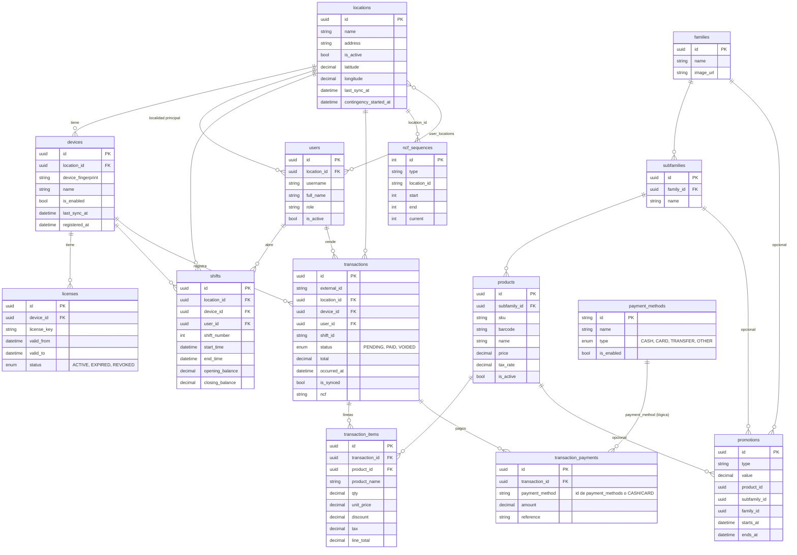
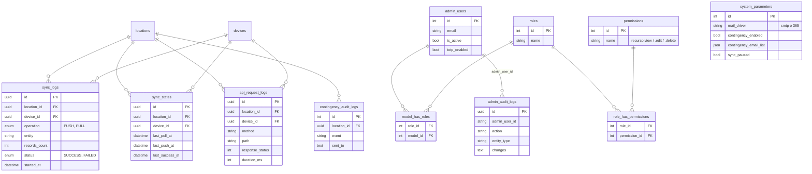

# Tap&Go POS — Backend

Backend del sistema punto de venta **Tap&Go**. Expone la API que usa la app Android (offline-first) y el panel web con el que se administran localidades, dispositivos, catálogo, ventas y reportes.




## Contenido

- [Funcionalidades](#funcionalidades)
- [Capturas](#capturas)
- [Arquitectura](#arquitectura)
- [Modelo de datos](#modelo-de-datos)
- [Puesta en marcha](#puesta-en-marcha)
- [Despliegue con Docker](#despliegue-con-docker)
- [Estructura del proyecto](#estructura-del-proyecto)
- [Tests y calidad](#tests-y-calidad)
- [Documentación](#documentación)

## Funcionalidades

**API para la app Android** (`/api`, Sanctum)
- Registro del dispositivo con token de emparejamiento y validación de licencia en cada llamada (`device.operational`).
- Sincronización offline-first: `POST /api/sync/push` (ventas, turnos, pagos) y `GET /api/sync/pull` (catálogo, usuarios, métodos de pago e imágenes optimizadas).
- Reportes para el POS: `GET /api/reports/dashboard` y `/api/reports/by-location`.

**Panel de administración** (`/admin`)
- **Dashboard comercial**: ventas, ticket promedio, anulaciones, tendencia diaria, mezcla por familia y método de pago, top de productos y localidades.
- **Dashboard técnico**: localidades en contingencia, dispositivos sin sincronizar, licencias por vencer y salud de la sincronización. Cada alerta abre su detalle en un modal.
- Ambos dashboards se filtran por localidad.
- **CRUD configurable**: cada pantalla se define en `config/admin_screens.php` (columnas, filtros, formularios, importes).
- **Reportes** con exportación a Excel, CSV y PDF: productos más vendidos, ingresos por método de pago, rendimiento de usuarios, cierre de caja y transacciones.
- **Seguridad**: permisos por rol (RBAC con Spatie), verificación en dos pasos (TOTP), bloqueo por intentos fallidos y auditoría de cambios.
- **Operación**: contingencia por localidad con avisos por correo (SMTP o Microsoft 365), parámetros del sistema y logs de API y sincronización.
- **Facturación dominicana**: secuencias NCF con alerta de rango bajo. El plan de e-CF con la DGII está en `docs/implementacion-dgii.md`.

El panel está en español y usa un formato de cifras único (`$13,095.50`, `39.8%`).

## Capturas

| Dashboard técnico: contingencia en modal | Reporte de ingresos por método de pago |
| --- | --- |
|  |  |
| **Grid de transacciones** | **Inicio de sesión** |
|  |  |

<p align="center">
  <br>
  <sub>El panel también funciona en el móvil.</sub>
</p>

## Arquitectura



| Componente | Detalle |
| --- | --- |
| **Contenedor `app`** | Una imagen con Nginx, PHP-FPM y el scheduler, orquestados por `supervisord` (`docker/supervisord.conf`). Publica el puerto `8082`. |
| **Laravel** | Una sola aplicación sirve la API (`routes/api.php`, Sanctum con el modelo `Device`) y el panel (`routes/web.php`, guard `admin`). La lógica de negocio vive en `app/Services`. |
| **Scheduler** | `schedule:run` cada 60 s (tareas en `routes/console.php`), por ejemplo los recordatorios de contingencia. |
| **Cola** | `QUEUE_CONNECTION=database`: los trabajos se guardan en la tabla `jobs`. Los correos de contingencia y el aviso de NCF usan la cola. |
| **MySQL 8.4** | Datos de negocio, sesiones, caché, cola y permisos. phpMyAdmin en el puerto `8081`. |
| **Almacenamiento** | `./storage` montado como volumen: imágenes de productos y familias, miniaturas WebP y logs. |
| **Correo** | Se configura desde *Parámetros del sistema*: SMTP o Microsoft 365 (Graph API). |

> [!WARNING]
> `supervisord` no levanta un worker de colas, así que en Docker los trabajos de la tabla `jobs` (correos de contingencia, aviso de NCF) quedan pendientes. Hasta que se agregue el proceso, se puede correr a mano con `./deploy.sh ssh` y `php artisan queue:work`.

## Modelo de datos

Todas las tablas de negocio usan UUID como clave primaria. `admin_users` y las tablas de permisos de Spatie usan enteros.

### Operación POS



### Sincronización, auditoría y seguridad del panel



Relaciones sin clave foránea en la base de datos:
- `transaction_payments.payment_method` guarda el `id` de `payment_methods` o, en ventas antiguas, una categoría (`CASH`, `CARD`, `TRANSFER`, `OTHER`).
- `promotions` apunta a producto, subfamilia o familia según su alcance.
- `ncf_sequences.location_id` identifica la localidad de la secuencia.

## Puesta en marcha

Requisitos: PHP 8.3 con GD, Composer y Node 20+. `.env.example` usa sqlite, así que no hace falta MySQL para desarrollar; en Docker se usa MySQL 8.4.

```bash
composer setup                 # instala dependencias, crea .env, genera la clave, migra y compila assets
php artisan db:seed            # datos de demostración (DemoPosSeeder)
composer dev                   # servidor, cola, logs y Vite en paralelo
```

El panel queda en `http://localhost:8000/admin`. El seeder de demostración crea el usuario `backend.admin@demo.local` con la contraseña `Backend123!`. Úsalo solo en local.

Variables clave del `.env`:

| Variable | Valor | Para qué |
| --- | --- | --- |
| `APP_TIMEZONE` | `America/Santo_Domingo` | Todo el backend opera en GMT-4 |
| `APP_LOCALE` | `es` | Idioma del panel y de los mensajes de validación |
| `QUEUE_CONNECTION` | `database` | Cola para los correos de contingencia |

## Despliegue con Docker

```bash
npm run build          # los assets se compilan antes de construir la imagen
./deploy.sh up         # construye y levanta app, mysql y phpmyadmin
./deploy.sh logs app   # logs del contenedor
./deploy.sh ssh        # shell dentro del contenedor
```

| Servicio | Puerto |
| --- | --- |
| Panel y API | `8082` |
| phpMyAdmin | `8081` |
| MySQL | `3306` |

Después de cambiar `config/` o el `.env` en producción, corre `php artisan config:clear` (o reconstruye el contenedor). La guía completa está en [`documentation/docker/INSTALL_GUIDE.md`](documentation/docker/INSTALL_GUIDE.md).

## Estructura del proyecto

```
app/
├── Http/Controllers/Api/      # API para Android: auth, sync, reportes
├── Http/Controllers/Admin/    # Panel: dashboards, CRUD por config, reportes, RBAC
├── Services/                  # Dashboard, reportes, sync, NCF, miniaturas
├── Support/                   # Motor de grids, RBAC, formato de cifras
└── Jobs/, Observers/          # Contingencia (correos y recordatorios)
config/
├── admin_screens.php          # Definición de cada pantalla del panel
├── admin_nav_groups.php       # Grupos del menú lateral
└── admin_rbac.php             # Roles de referencia
resources/views/admin/         # Vistas Blade del panel
resources/js/                  # Alpine y gráficos (ApexCharts)
lang/es/                       # Traducciones al español
postman/                       # Colecciones con los contratos de la API
docker/                        # Nginx, PHP y supervisord
```

## Tests y calidad

```bash
php artisan test         # suite completa (sqlite en memoria)
vendor/bin/pint          # formato del código PHP
```

Los 3 tests de `FamilyImageUploadTest` necesitan una base de datos real con `DemoPosSeeder` y fallan en sqlite. Las convenciones del proyecto están en [`AGENTS.md`](AGENTS.md).

## Documentación

- [Guía de instalación con Docker](documentation/docker/INSTALL_GUIDE.md)
- [Plan de facturación electrónica DGII](docs/implementacion-dgii.md)
- Referencia de la API: colecciones Postman en [`postman/`](postman/)
